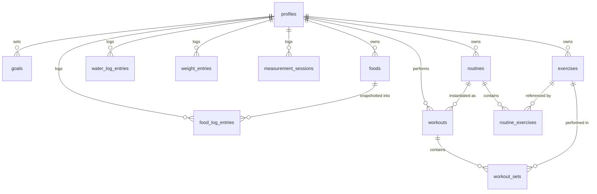

# FitLog — Personal Health, Fitness & Nutrition Tracker

**Technical Specification & Development Plan**

| | |
|---|---|
| Document status | v1.0 — Design / pre-development |
| Author | Senior Full-Stack Architecture review |
| Date | 2026-07-15 |
| Scope | Nutrition, Weight, Body Measurements, Workout logging |

---

## 1. Executive Summary & Key Decisions

Two open questions in the brief are resolved here with explicit recommendations:

### Decision 1 — Platform: **Mobile-first Web App (PWA)**

| Criterion | PWA (recommended) | Native (React Native/Flutter) |
|---|---|---|
| Time to MVP | **Weeks** — one codebase, one deploy target | Months — app-store review, per-OS quirks |
| Distribution | Instant: open a URL, "Add to Home Screen" | App Store / Play Store accounts, review cycles |
| Iteration speed | Deploy fixes in minutes | Store review per release |
| Gym usability | Fullscreen standalone mode, dark theme, works fine | Marginally better haptics/offline |
| Future multi-user | Trivial (it's already a web service) | Same backend, extra client work |

For a personal tool that must minimize friction *for the developer as well as the user*, a PWA wins decisively. If native-feel becomes a hard requirement later, the backend and most UI logic carry over to a React Native or Capacitor wrapper unchanged.

### Decision 2 — Data storage: **Cloud database (Supabase/Postgres) with an offline-tolerant client**

The brief asks for a scalable, multi-user-ready architecture. That rules out purely local storage as the source of truth. Supabase gives us:

- **Postgres** — real relational schema, the one designed in §4, with Row-Level Security (RLS) so multi-user support later is a policy change, not a rewrite.
- **Built-in auth** (email magic link / OAuth) — even a single user should log in once, so the schema is multi-tenant from day one.
- **Free tier** comfortably covers personal use.
- **Offline tolerance** (not full offline-first) on the client: log entries are written to a local queue (IndexedDB) first and synced when connectivity returns. Full CRDT-style offline sync is deliberately out of MVP scope — the queue covers the realistic gym scenario (spotty Wi-Fi during a workout).

### Decision 3 — Stack summary

| Layer | Choice | Why |
|---|---|---|
| Frontend | **Next.js 15 (App Router) + TypeScript** | Matches existing team stack; SSR for fast first paint; API routes if needed |
| UI | **Tailwind CSS + shadcn/ui + Recharts** | Rapid, consistent, dark-mode-native; Recharts for weight/macro charts |
| State/data | **TanStack Query** + a thin IndexedDB write queue | Cache + optimistic updates = "zero-wait" logging UX |
| Backend | **Supabase** (Postgres, Auth, RLS, auto-generated REST) | No server code to maintain for CRUD; Postgres functions for aggregates |
| PWA | `next-pwa` / Serwist service worker, Web App Manifest | Installable, offline shell, home-screen icon |
| Hosting | Vercel (frontend) + Supabase cloud (data) | Both free-tier for personal use |
| Testing | Vitest (unit), Playwright (e2e happy paths) | Keep it light for a personal project |

---

## 2. System Architecture

```
┌─────────────────────────────────────────────────────────┐
│  Phone / Desktop browser (PWA, installed to home screen)│
│                                                         │
│  Next.js client                                         │
│  ├─ UI (Tailwind + shadcn/ui, dark mode default)        │
│  ├─ TanStack Query cache  ── optimistic updates         │
│  ├─ IndexedDB write queue ── survives offline / reload  │
│  └─ Service worker        ── app-shell caching          │
└──────────────────────────┬──────────────────────────────┘
                           │ HTTPS (supabase-js, JWT auth)
                           ▼
┌─────────────────────────────────────────────────────────┐
│  Supabase                                               │
│  ├─ Auth (email magic link → JWT)                       │
│  ├─ PostgREST (auto CRUD API over the schema)           │
│  ├─ Postgres                                            │
│  │   ├─ Tables (§4) — all rows scoped by user_id        │
│  │   ├─ RLS policies: user_id = auth.uid() on every table│
│  │   └─ Views/functions: weekly weight averages,        │
│  │       daily nutrition totals, last-performance lookup│
│  └─ (later) Edge Functions for anything non-CRUD        │
└─────────────────────────────────────────────────────────┘
```

**Key architectural principles**

1. **Multi-tenant from row one.** Every table carries `user_id`; RLS enforces isolation. Adding registration later = enabling the sign-up page.
2. **The database does the math.** Weekly rolling averages, daily macro totals, and "previous performance" are SQL views/functions, not client-side loops — they stay correct regardless of which client consumes them.
3. **Optimistic everything.** Every log action updates the UI instantly from the local cache and syncs in the background. A failed sync retries from the IndexedDB queue; the user never waits on a spinner to log a set.
4. **No custom backend server for MVP.** PostgREST + RLS covers all CRUD. Custom endpoints (Edge Functions) only appear if/when we add things like barcode lookup or AI meal parsing.

---

## 3. Units, Time & Localization Groundwork

- **Timestamps:** stored as `timestamptz` (UTC). "Day" boundaries computed with the user's IANA timezone stored in `profiles.timezone`.
- **Units:** stored canonically in **metric** (kg, cm, ml). `profiles.unit_weight` (`kg|lb`) and `profiles.unit_length` (`cm|in`) drive display conversion only. This avoids mixed-unit data forever.
- **i18n:** English-only UI, but all strings routed through a message catalog (`next-intl`) from the start — localization later is a translation task, not a refactor.

---

## 4. Database Schema

All tables: `id uuid primary key default gen_random_uuid()`, `user_id uuid not null references auth.users(id)`, `created_at timestamptz not null default now()`. RLS policy on every table: `user_id = auth.uid()`. Only additional fields are listed below.

### 4.1 Profile & Goals

```sql
-- profiles: 1:1 with auth.users
create table profiles (
  id           uuid primary key references auth.users(id),
  display_name text,
  timezone     text not null default 'Asia/Jerusalem',
  unit_weight  text not null default 'kg'  check (unit_weight in ('kg','lb')),
  unit_length  text not null default 'cm'  check (unit_length in ('cm','in')),
  created_at   timestamptz not null default now()
);

-- goals: versioned so history stays honest when targets change
create table goals (
  id             uuid primary key default gen_random_uuid(),
  user_id        uuid not null references auth.users(id),
  effective_from date not null default current_date,
  calories_kcal  int,          -- daily target
  protein_g      int,
  carbs_g        int,
  fat_g          int,
  water_ml       int,          -- daily water target
  target_weight_kg numeric(5,2),
  created_at     timestamptz not null default now()
);
-- "current goal" = latest row with effective_from <= today
```

### 4.2 Module A — Nutrition

```sql
-- foods: the user's personal food/meal library ("saved favorites")
create table foods (
  id            uuid primary key default gen_random_uuid(),
  user_id       uuid not null references auth.users(id),
  name          text not null,
  -- macros per 1 serving as the user defines it
  calories_kcal numeric(7,1) not null,
  protein_g     numeric(6,1) not null default 0,
  carbs_g       numeric(6,1) not null default 0,
  fat_g         numeric(6,1) not null default 0,
  serving_label text,                  -- e.g. "1 cup", "100 g", "1 scoop"
  is_favorite   boolean not null default false,
  use_count     int not null default 0, -- drives "frequent foods" sorting
  archived_at   timestamptz,           -- soft delete: keeps old log entries intact
  created_at    timestamptz not null default now()
);

create table food_log_entries (
  id            uuid primary key default gen_random_uuid(),
  user_id       uuid not null references auth.users(id),
  logged_at     timestamptz not null default now(),
  log_date      date not null,          -- user-local date, set by client
  meal          text not null check (meal in ('breakfast','lunch','dinner','snack')),
  food_id       uuid references foods(id),  -- null for one-off quick entries
  description   text,                   -- free text for quick entries
  servings      numeric(5,2) not null default 1,
  -- denormalized snapshot: totals for THIS entry (servings already applied).
  -- Editing a saved food later must not rewrite history.
  calories_kcal numeric(7,1) not null,
  protein_g     numeric(6,1) not null default 0,
  carbs_g       numeric(6,1) not null default 0,
  fat_g         numeric(6,1) not null default 0
);
create index on food_log_entries (user_id, log_date);

create table water_log_entries (
  id        uuid primary key default gen_random_uuid(),
  user_id   uuid not null references auth.users(id),
  logged_at timestamptz not null default now(),
  log_date  date not null,
  amount_ml int not null check (amount_ml > 0)
);
create index on water_log_entries (user_id, log_date);
```

```sql
-- Daily totals view feeding the progress rings
create view daily_nutrition as
select user_id, log_date,
       sum(calories_kcal) as calories_kcal,
       sum(protein_g)     as protein_g,
       sum(carbs_g)       as carbs_g,
       sum(fat_g)         as fat_g
from food_log_entries
group by user_id, log_date;
```

### 4.3 Module B — Weight

```sql
create table weight_entries (
  id        uuid primary key default gen_random_uuid(),
  user_id   uuid not null references auth.users(id),
  logged_at timestamptz not null default now(),
  log_date  date not null,
  weight_kg numeric(5,2) not null check (weight_kg between 20 and 400),
  note      text
);
create unique index on weight_entries (user_id, log_date); -- one weigh-in/day; upsert on conflict

-- 7-day rolling average, smoothing water-weight noise
create view weight_rolling_avg as
select user_id, log_date, weight_kg,
       avg(weight_kg) over (
         partition by user_id order by log_date
         range between interval '6 days' preceding and current row
       ) as avg_7d
from weight_entries;
```

### 4.4 Module C — Body Measurements

One row per measurement session; nullable columns beat an EAV table here — the metric set is small, fixed by the brief, and queried side-by-side for the comparison view.

```sql
create table measurement_sessions (
  id          uuid primary key default gen_random_uuid(),
  user_id     uuid not null references auth.users(id),
  measured_at timestamptz not null default now(),
  log_date    date not null,
  chest_cm       numeric(5,1),
  arm_left_cm    numeric(5,1),
  arm_right_cm   numeric(5,1),
  waist_cm       numeric(5,1),
  abdomen_cm     numeric(5,1),   -- at belly button
  thigh_left_cm  numeric(5,1),
  thigh_right_cm numeric(5,1),
  note        text
);
create index on measurement_sessions (user_id, log_date);
```

### 4.5 Module D — Workouts

```sql
create table exercises (
  id           uuid primary key default gen_random_uuid(),
  user_id      uuid not null references auth.users(id),
  name         text not null,
  muscle_group text not null check (muscle_group in
    ('chest','back','shoulders','biceps','triceps','legs','glutes','core','other')),
  archived_at  timestamptz,      -- soft delete: history keeps its exercise names
  created_at   timestamptz not null default now()
);
-- MVP seeds ~40 common exercises per user on first login; fully editable after.

create table routines (            -- e.g. "Workout A — Push"
  id         uuid primary key default gen_random_uuid(),
  user_id    uuid not null references auth.users(id),
  name       text not null,
  position   int not null default 0,
  archived_at timestamptz,
  created_at timestamptz not null default now()
);

create table routine_exercises (   -- ordered template contents
  id          uuid primary key default gen_random_uuid(),
  routine_id  uuid not null references routines(id) on delete cascade,
  exercise_id uuid not null references exercises(id),
  position    int not null,
  target_sets int not null default 3
);

create table workouts (            -- one performed session
  id          uuid primary key default gen_random_uuid(),
  user_id     uuid not null references auth.users(id),
  routine_id  uuid references routines(id),  -- null for ad-hoc workouts
  started_at  timestamptz not null default now(),
  finished_at timestamptz,                   -- null while in progress
  note        text
);

create table workout_sets (        -- the atomic unit of training data
  id          uuid primary key default gen_random_uuid(),
  user_id     uuid not null references auth.users(id),
  workout_id  uuid not null references workouts(id) on delete cascade,
  exercise_id uuid not null references exercises(id),
  set_number  int not null,
  weight_kg   numeric(6,2) not null default 0,  -- 0 = bodyweight
  reps        int not null check (reps > 0),
  logged_at   timestamptz not null default now()
);
create index on workout_sets (user_id, exercise_id, logged_at desc);
```

```sql
-- Progressive-overload helper: last completed performance per exercise
create or replace function last_performance(p_exercise uuid)
returns table (performed_at timestamptz, set_number int, weight_kg numeric, reps int)
language sql stable as $$
  select ws.logged_at, ws.set_number, ws.weight_kg, ws.reps
  from workout_sets ws
  join workouts w on w.id = ws.workout_id and w.finished_at is not null
  where ws.exercise_id = p_exercise and ws.user_id = auth.uid()
    and w.id = (
      select w2.id from workouts w2
      join workout_sets ws2 on ws2.workout_id = w2.id
      where ws2.exercise_id = p_exercise and w2.user_id = auth.uid()
        and w2.finished_at is not null
      order by w2.started_at desc limit 1)
  order by ws.set_number;
$$;
```

### 4.6 Entity-Relationship Overview



---

## 5. User Flow & UI/UX

### 5.1 Information architecture

Bottom tab bar (thumb-reachable, five items max):

```
┌──────────────────────────────────────────────┐
│  [Today]  [Food]  [ + ]  [Train]  [Trends]   │
└──────────────────────────────────────────────┘
```

- **Today** — dashboard: rings, water, weight quick-log, "start workout".
- **Food** — the day's meal log + favorites.
- **+ (center FAB)** — global quick-add sheet: Food / Water / Weight / Workout / Measurements. Anything loggable is ≤2 taps from anywhere.
- **Train** — routines, exercise library, workout history.
- **Trends** — weight chart, measurement comparison, macro history.

### 5.2 Design language

- **Dark mode is the default** (gym-first), light mode optional. Pure-black `#0A0A0B` background (OLED-friendly), high-contrast text (WCAG AA, ≥ 4.5:1), a single accent color per module (nutrition = green, weight = blue, training = orange, water = cyan) used sparingly on rings/charts.
- Large touch targets (≥ 44 px), numeric keypads (`inputmode="decimal"`) for all number entry, steppers for reps/sets.
- No confirmation dialogs on log actions — log instantly, offer **Undo** via toast instead.

### 5.3 Key screens (wireframes)

**Today (dashboard)**

```
┌────────────────────────────┐
│ Tue, Jul 15        ⚙  🌙   │
│                            │
│      ◐ 1,640 / 2,200 kcal  │   ← large calorie ring
│   P 118/160  C 150/220     │   ← three mini macro bars
│   F 48/70                  │
│                            │
│ 💧 Water  ●●●○○○○○  1.5/2L │   ← tap a dot = +250 ml
│                            │
│ ⚖ 82.4 kg  ▼0.3 this week │   ← tap = log today's weight
│                            │
│ ▶ Start "Workout A — Push" │   ← next routine suggested
│                            │
│ [Today] [Food] [+] [Train] [Trends]
└────────────────────────────┘
```

**Food log — day view**

```
┌────────────────────────────┐
│ ◀ Tue, Jul 15 ▶            │
│ Breakfast          420 kcal│
│  • Oatmeal + whey      320 │
│  • Banana              100 │
│  [+ add]                   │
│ Lunch              690 kcal│
│  ...                       │
│ Snacks · Dinner ...        │
└────────────────────────────┘
```

**Add food sheet** (opens on [+ add]; the friction-critical screen)

```
┌────────────────────────────┐
│ Add to: Lunch          ✕   │
│ ┌─ Frequent ─────────────┐ │  ← top: use_count-sorted chips,
│ │ 🍗 Chicken+rice  620   │ │    ONE tap logs 1 serving
│ │ 🥣 Greek yogurt  150   │ │
│ │ 🍳 3 eggs        210   │ │
│ └────────────────────────┘ │
│ 🔍 Search my foods…        │
│ ── or quick entry ──       │
│ kcal [____] P [__] C [__]  │
│ F [__]  desc [________]    │
│           [ Log it ]       │
│ ☐ also save to favorites   │
└────────────────────────────┘
```

**Active workout logger** (the other friction-critical screen)

```
┌────────────────────────────┐
│ Workout A — Push     23:41 │  ← running timer
│                            │
│ BENCH PRESS        2/3 sets│
│ ┌──────────────────────── ┐│
│ │ Last time: 80kg×8,8,7   ││  ← progressive-overload helper,
│ └──────────────────────── ┘│    always visible
│ Set 1  ✓ 80 kg × 8         │
│ Set 2  ✓ 80 kg × 8         │
│ Set 3  [80 kg] [ 8 ] [Log] │  ← pre-filled with last values;
│         −/+     −/+        │    steppers, one tap to log
│                            │
│ Next: Incline DB Press  ▸  │
│ [Finish workout]           │
└────────────────────────────┘
```

Logging a set that matches last time = **one tap**. Weight/reps pre-fill from the previous set of this session, falling back to `last_performance()`.

### 5.4 Core user flows

1. **Log a frequent meal:** `+` → Food (meal pre-selected by time of day) → tap frequent chip → done. **2 taps.**
2. **Log water:** Today → tap next water dot. **1 tap.**
3. **Log weight:** Today → tap weight card → keypad pre-filled with last weight → save. **~3 taps.**
4. **Run a workout:** Today → "Start Workout A" → for each exercise, adjust ± and Log per set → Finish. Each set ≈ 1–3 taps.
5. **Measurements (bi-weekly):** `+` → Measurements → single form, all 7 fields, previous values shown as placeholders → save.

---

## 6. Phased Roadmap

### Phase 0 — Foundation (≈ 1 week)
- Scaffold Next.js 15 + TypeScript + Tailwind + shadcn/ui in this monorepo (`apps/fitlog`).
- Supabase project; migrations for §4 schema; RLS policies; seed exercise library.
- Auth (magic link), `profiles` bootstrap on first login, dark theme, PWA manifest + installability.
- **Exit criteria:** installable app, logged-in shell with tab navigation deployed to Vercel.

### Phase 1 — MVP: the daily loop (≈ 2–3 weeks) ✅ *usable every day from here*
- **Nutrition:** meal-grouped day log, quick manual entry, favorites CRUD + frequent-chips, calorie ring + macro bars, water dots. Goals settings page.
- **Weight:** log/upsert daily weight, 7/30-day line chart with 7-day rolling average overlay.
- **Workouts:** exercise library CRUD, routine templates, active logger with set logging, pre-fill, and `last_performance` display. Workout history list.
- Optimistic updates + IndexedDB write queue for all log actions.
- **Exit criteria:** all four daily/weekly logging actions ≤3 taps; app trusted enough to replace spreadsheets.

### Phase 2 — Trends & measurements (≈ 1–2 weeks)
- Body measurements form + per-metric comparison table and sparkline deltas.
- Weight chart 3-month/1-year ranges; weekly-average table.
- Nutrition history: calendar heat-strip of adherence vs. goals.
- Per-exercise progression chart (best set / est. 1RM over time).
- CSV export of all data (trust + backup).

### Phase 3 — Polish & hardening (≈ 1–2 weeks)
- Undo toasts everywhere; edit/delete for every entry type; empty states.
- Unit preference (lb/in) display conversion; timezone edge cases.
- Offline queue retry UX ("2 entries pending sync"); Playwright e2e on the 5 core flows.
- Performance pass: <1 s cold start on mid-range phone, Lighthouse PWA ≥ 90.

### Phase 4 — Future (backlog, post-personal-use)
- Public registration + onboarding (RLS makes this a UI task).
- Barcode scanning / food-database API (Open Food Facts) via Edge Function.
- Rest timers + notifications during workouts; Apple Health / Google Fit import.
- AI meal parsing ("chicken salad and a coke" → macros) via Claude API.
- Localization (Hebrew incl. RTL — the message-catalog groundwork is already in).

---

## 7. Recommended First Steps (concrete)

1. `pnpm create next-app apps/fitlog` (TS, App Router, Tailwind) and add it to `pnpm-workspace.yaml`.
2. Create the Supabase project; commit `supabase/migrations/0001_init.sql` with the §4 schema + RLS; run `supabase db push`.
3. Wire auth + the `Today` shell with hardcoded data; deploy to Vercel immediately (deploy-first, then build features against production).
4. Build vertical slice #1 end-to-end: **water logging** (smallest full loop: tap → optimistic update → Supabase insert → ring refresh). It proves the whole data path in a day.
5. Proceed through Phase 1 in the order: nutrition → weight → workouts.

---

*End of specification.*
