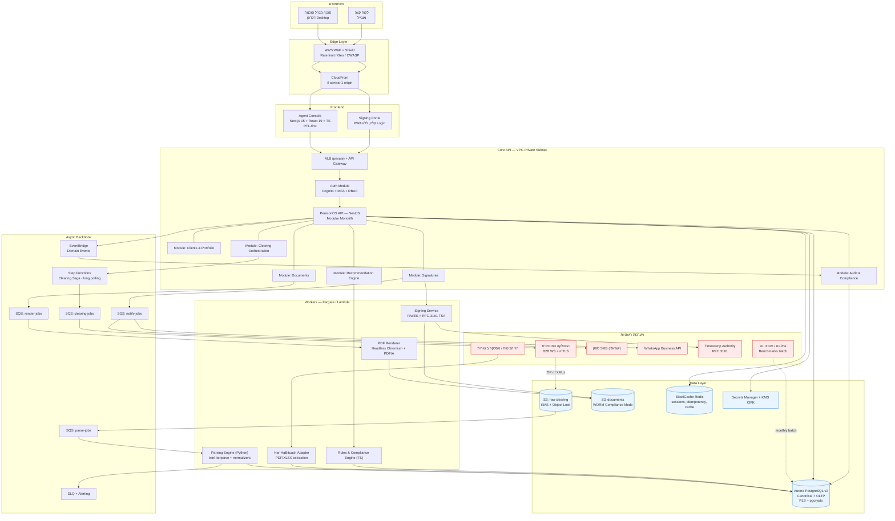
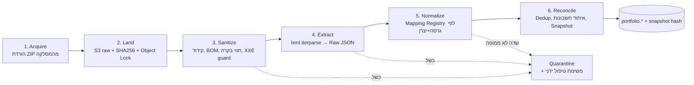
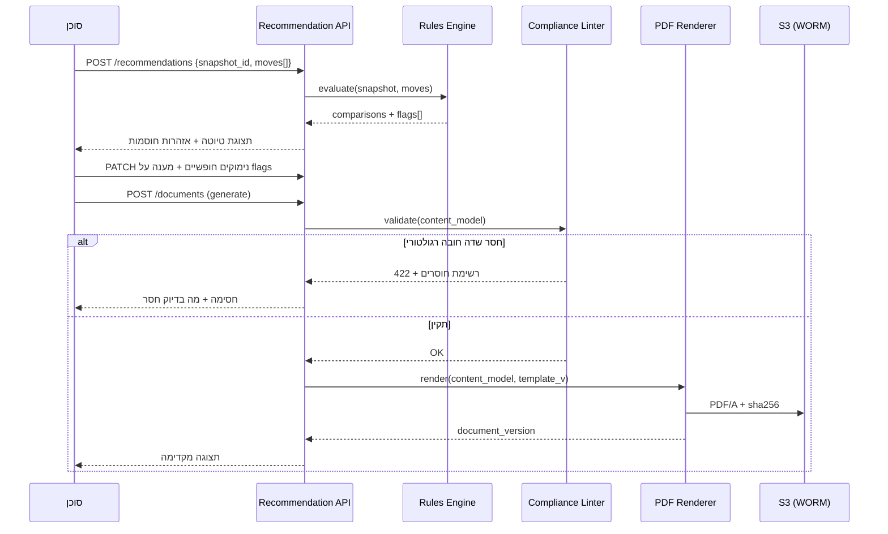
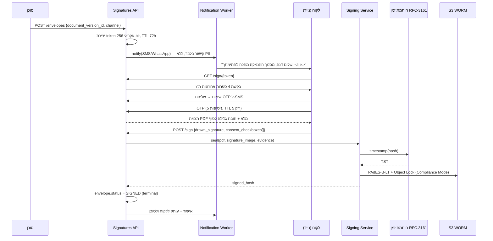

# 01 — ארכיטקטורת מערכת (High-Level Architecture)

## 1. עקרונות אדריכליים מנחים

| # | עיקרון | משמעות מעשית |
|---|---|---|
| P1 | **Snapshot Immutability** | נתונים שהתקבלו מהמסלקה אינם ניתנים לעריכה. תיקון = גרסה חדשה. הנמקה נצמדת ל-Snapshot מסוים ב-Hash. |
| P2 | **Anti-Corruption Layer** | הפורמט המזעזע של המסלקה לעולם לא דולף פנימה. יש `Raw Layer` ← `Canonical Layer`. הליבה מכירה רק קנוני. |
| P3 | **Async by default** | כל מה שנוגע למסלקה, PDF וחתימות — תור + Worker. אין בקשת HTTP סינכרונית שמחכה לגורם חיצוני. |
| P4 | **Deterministic Compliance** | טקסט ההנמקה נגזר מ-Rules Engine עם גרסה. אותם קלטים ⇒ אותו מסמך, תמיד. |
| P5 | **Tenant Isolation by Default** | `tenant_id` בכל טבלה + PostgreSQL RLS. אין שאילתה שלא עוברת דרך פוליסת RLS. |
| P6 | **Data Residency in Israel** | כל PII נשמר ומעובד ב-`il-central-1` (AWS Tel Aviv). שירותי צד ג' מקבלים מזהים אטומים בלבד. |
| P7 | **Modular Monolith → Microservices** | ב-MVP: מונוליט מודולרי אחד + Workers נפרדים. גבולות השירותים מוגדרים כבר עכשיו, הפיצול הפיזי יגיע עם העומס. |

> **הערה על "Microservices"**: לצוות של 5 מפתחים, פיצול ל-12 מיקרו-שירותים ב-MVP הוא
> התאבדות תפעולית. הפתרון: **Modular Monolith** עם גבולות מודולים נוקשים (`@module` boundaries,
> אין import חוצה-מודול אלא דרך Public API), **פלוס** הפרדה פיזית אמיתית של שני רכיבים
> שבאמת דורשים אותה: **Parser Workers** (Python, CPU-bound, blast radius) ו-**Signing Service**
> (גבול אבטחה — מחזיק מפתחות חתימה). זה נותן את יתרונות הסקלביליות בלי חוב תפעולי.

---

## 2. דיאגרמת מערכת ראשית (C4 — Container Level)



---

## 3. פירוט הרכיבים

### 3.1 Frontend

| רכיב | טכנולוגיה | הערות מפתח |
|---|---|---|
| **Agent Console** | Next.js 15 (App Router), React 19, TypeScript, Tailwind + shadcn/ui | `dir="rtl"` ברמת ה-`<html>`, לוגיקת Logical Properties בלבד (`ms-`/`me-` ולא `ml-`/`mr-`). גופן Assistant/Rubik מוטמע. |
| **Signing Portal** | Next.js Route Group נפרד, Bundle < 120KB gzip | ללא Login, ללא Cookies של הקונסולה, CSP נוקשה, נטען מ-CDN, עובד על 3G ובדפדפנים ישנים (Safari 14+). |
| **State** | TanStack Query + Zustand ל-UI state | אין Redux. Server state נשאר ב-Query cache עם `staleTime` קצר לנתוני תיק. |
| **Validation** | Zod schemas משותפים FE/BE (חבילת `@pensionos/contracts`) | מקור אמת יחיד לטיפוסים; DTOs נגזרים מ-Zod. |

> **החלטת SSR:** רינדור צד-שרת של דפי תיק לקוח מבוצע **בתוך ה-VPC בישראל** (Fargate),
> ולא ב-Vercel Edge. שום PII לא עובר דרך פלטפורמת אירוח מחוץ לישראל. נכסים סטטיים בלבד ב-CDN.

### 3.2 Core API — Modular Monolith (NestJS)

```
apps/api/src/modules/
├── identity/          # Users, Tenants, RBAC, Cognito bridge
├── clients/           # Clients, family members, consents
├── clearing/          # Clearing requests orchestration (Saga)
├── portfolio/         # Canonical products, policies, coverages, snapshots
├── recommendation/    # Rules engine facade, comparison builder
├── documents/         # Document lifecycle, versions, templates
├── signatures/        # Envelopes, OTP, evidence package
├── notifications/     # SMS/WhatsApp abstraction
└── audit/             # Immutable audit log, compliance reports
```

חוקי גבולות (נאכפים ב-ESLint + `dependency-cruiser` ב-CI):
- מודול חושף רק `index.ts` ציבורי; אסור לייבא `internal/*` ממודול אחר.
- תקשורת בין מודולים: Service Interface סינכרוני **או** Domain Event ב-EventBridge.
- לכל מודול Schema נפרד ב-PostgreSQL (`clearing.*`, `portfolio.*`) → פיצול עתידי ללא Migration כואב.

### 3.3 מנוע הקליטה והפענוח (Data Ingestion Engine) — הליבה

זהו הרכיב עם הסיכון הטכני הגבוה ביותר בפרויקט. הוא בנוי כ-**Pipeline בן 6 שלבים**,
כאשר בין כל שלב יש Persistence — כך שכשל בשלב 4 לא מחייב פנייה חוזרת (ובתשלום) למסלקה.



#### שלב 3 — Sanitize (הבעיה הכי נפוצה בשטח)

```python
# workers/parser/sanitize.py
import re
from charset_normalizer import from_bytes

# תווי בקרה לא-חוקיים ב-XML 1.0 (למעט TAB/LF/CR)
ILLEGAL_XML = re.compile(
    r"[\x00-\x08\x0B\x0C\x0E-\x1F\x7F]"
)
# סימני כיווניות שמזהמים שמות בעברית ושוברים השוואות מחרוזות
BIDI_MARKS = re.compile(r"[‎‏‪-‮⁦-⁩]")

DECLARED = re.compile(rb'encoding\s*=\s*["\']([\w\-]+)["\']', re.I)

def sanitize(raw: bytes) -> tuple[str, dict]:
    """מחזיר XML נקי כ-str + דוח תיקונים לאודיט."""
    report = {"fixes": []}

    # 1. BOM
    if raw.startswith(b"\xef\xbb\xbf"):
        raw = raw[3:]; report["fixes"].append("utf8_bom_stripped")

    # 2. הצהרת קידוד מול קידוד בפועל — התקלה הקלאסית:
    #    <?xml encoding="UTF-8"?> אבל הבייטים הם windows-1255
    declared = (m.group(1).decode() if (m := DECLARED.search(raw[:200])) else None)
    try:
        text = raw.decode(declared or "utf-8")
        # heuristics: אם קיבלנו הרבה U+FFFD או ג'יבריש לטיני — הקידוד שיקר
        if text.count("�") > 0 or _looks_like_mojibake(text):
            raise UnicodeDecodeError("declared", b"", 0, 1, "mojibake")
    except (UnicodeDecodeError, LookupError):
        guess = from_bytes(raw).best()
        enc = (guess.encoding if guess else "cp1255")
        text = raw.decode(enc, errors="replace")
        report["fixes"].append(f"reencoded_from_{enc}")

    # 3. ניקוי תווים
    text, n = ILLEGAL_XML.subn("", text)
    if n: report["fixes"].append(f"illegal_control_chars:{n}")
    text, n = BIDI_MARKS.subn("", text)
    if n: report["fixes"].append(f"bidi_marks:{n}")

    # 4. נרמול Unicode לעברית (NFC) — קריטי להשוואת שמות ולחיפוש
    import unicodedata
    text = unicodedata.normalize("NFC", text)

    # 5. הצהרת הקידוד בקובץ כבר לא נכונה — מסירים אותה לפני parse
    text = re.sub(r"<\?xml[^>]*\?>", '<?xml version="1.0"?>', text, count=1)
    return text, report
```

#### שלב 4 — Extract (Streaming + Secure)

```python
from lxml import etree

def make_parser() -> etree.XMLParser:
    # הגנות חובה: XXE, Billion Laughs, External DTD, Network access
    return etree.XMLParser(
        resolve_entities=False,   # XXE
        no_network=True,          # SSRF via DTD
        dtd_validation=False,
        load_dtd=False,
        huge_tree=False,          # Billion laughs / quadratic blowup
        recover=True,             # קבצים שבורים — נאסוף מה שאפשר ונדווח
    )

def iter_accounts(path: str):
    """iterparse — לא DOM. קבצי מסלקה מגיעים עד 200MB עם פירוט הפקדות."""
    ctx = etree.iterparse(path, events=("end",), tag="HeshbonOPolisa",
                          parser=make_parser())
    for _, elem in ctx:
        yield elem
        elem.clear()                       # שחרור זיכרון
        while elem.getprevious() is not None:
            del elem.getparent()[0]        # ניקוי אחים
```

> **קביעת עיצוב:** ה-Parser **אינו** נכשל על שדה חסר. הוא מייצר `Extraction Result` עם
> `value | null` + `confidence` + `source_xpath` לכל שדה. ההחלטה מה לעשות עם `null` היא של
> שלב הנרמול, לפי מדיניות שדה — לא של ה-Parser.

#### שלב 5 — Normalize: Mapping Registry מונחה-דאטה

היצרנים (חברות ביטוח, בתי השקעות, קרנות פנסיה) **סוטים מהתקן**. פתרון בקוד = חוב נצחי.
לכן המיפוי הוא **רשומות ב-DB**, בגרסאות, עם fallback:

```jsonc
// portfolio.field_mappings — דוגמה לרשומה
{
  "canonical_field": "management_fee_on_balance_pct",
  "standard_version": "2.9",
  "provider_code": "*",                       // "*" = ברירת מחדל לתקן
  "xpath": ".//NetuneiMutzar/SHEUR-DMEI-NIHUL-ME-HATZVIRA",
  "fallback_xpaths": [
    ".//DmeiNihul/SHEUR-DMEI-NIHUL-TZVIRA",
    ".//YitraotLeSofShana/SHEUR-DMEI-NIHUL"
  ],
  "type": "decimal",
  "transform": ["trim", "strip_thousands_sep", "percent_normalize"],
  "range": { "min": 0, "max": 3 },
  "on_missing": "flag_for_review",            // reject | null | default | flag_for_review
  "required_for": ["recommendation.fee_comparison"]
}
```

- **`percent_normalize`**: יצרן א' מדווח `0.5`, יצרן ב' מדווח `0.005`, יצרן ג' `"0.50%"`.
  הטרנספורם מזהה לפי טווח וסימן `%` ומנרמל לאחוז עשרוני יחיד. חריגה מ-`range` ⇒ `flag_for_review`.
- **`required_for`**: אם שדה נדרש לחישוב בהנמקה חסר — **ה-Compliance Linter חוסם את הפקת המסמך**
  ומציג לסוכן בדיוק מה חסר ומאיזו קופה. אין מסמך הנמקה על נתונים חלקיים בשקט.

> ⚠️ שמות ה-Tags בדוגמאות הם ייצוגיים. ה-XPaths המדויקים ייגזרו מקובץ ה-XSD הרשמי של
> "המבנה האחיד" בגרסה שתסופק ב-Sprint 0, וייטענו כ-Seed לטבלת `field_mappings`.

#### שלב 6 — Reconcile

| אתגר | פתרון |
|---|---|
| אותו חשבון מדווח פעמיים (2 קבצים מאותו יצרן) | מפתח דדופליקציה: `(provider_code, policy_number, product_type)` + `report_date` האחרון מנצח |
| קופה "מסולקת"/לא פעילה | לא נמחקת — מסומנת `status='paid_up'` ומוצגת מוצללת ב-360° |
| חשבונות עם יתרה 0 וללא הפקדות 24 חודשים | `is_dormant=true`, מקופלים ב-UI תחת "לא פעילים" |
| שם לקוח שונה בין יצרנים | Master record מ-`clients`, השם מהיצרן נשמר ב-`raw` בלבד |
| ת"ז לא תואמת לבקשה | קובץ ל-Quarantine + התרעת אבטחה (חשד לדליפת מידע בין לקוחות) |

### 3.4 מחולל ההנמקה — Rules & Compliance Engine

שלושה תת-רכיבים:

**1. Comparison Builder** — בונה טבלאות השוואה מהנתונים הקנוניים:
דמי ניהול מהפקדה/מצבירה (קיים מול מוצע מול תקרה רגולטורית), מסלול השקעה ותשואות
מול Benchmark (גמל-נט/פנסיה-נט), כיסויים ביטוחיים (א.כ.ע, שאירים, נכות), עלויות כיסוי.

**2. Risk Flags Engine** — קטלוג חוקים מגורסן. כל חוק: `id`, `severity`, `condition (JSONLogic)`,
`text_template`, `requires_explicit_client_ack`.

| Rule ID | תיאור | חומרה | אפקט |
|---|---|---|---|
| `R-PEN-001` | ניוד מפוליסת ביטוח מנהלים עם מקדם קצבה מובטח (הצטרפות טרם 2013) | **Blocker** | חוסם המלצה עד נימוק חופשי + הצהרת לקוח נפרדת |
| `R-PEN-002` | ניוד מקרן פנסיה ותיקה | **Blocker** | חסימה מוחלטת + הצגת אזהרה |
| `R-INS-003` | ביטול/הקטנת א.כ.ע קיים | **Critical** | אזהרת חיתום מחדש + תקופת אכשרה |
| `R-INS-004` | קיים "מצב רפואי קודם" מוצהר / חריג בפוליסה קיימת | **Critical** | אזהרת אובדן כיסוי |
| `R-INS-005` | פוליסת בריאות/סיעוד ותיקה עם תנאי דור קודם | **Warning** | חובת נימוק להחלפה |
| `R-FEE-006` | דמי הניהול המוצעים ≥ הקיימים | **Warning** | חובת נימוק שאינו "דמי ניהול" |
| `R-FEE-007` | דמי ניהול חורגים מתקרה רגולטורית | **Blocker** | חסימה |
| `R-DAT-008` | נתון חובה חסר במוצר שנכלל בהמלצה | **Blocker** | חסימה עד השלמה/סימון "לא התקבל מהמסלקה" |
| `R-BEN-009` | אין מוטבים מעודכנים בקופה המומלצת | **Info** | תזכורת למשימה |

**3. Document Composer** — ממפה: `snapshot + recommendation + flags + agent disclosures`
→ מודל תוכן (JSON) → תבנית Handlebars → HTML (RTL) → PDF/A-2b.



### 3.5 רכיב החתימות (e-Sign)



**Evidence Package** (נשמר כ-JSON חתום לצד ה-PDF):
`document_sha256`, `snapshot_sha256`, `rules_version`, `template_version`,
`otp_verification_events[]`, `ip`, `user_agent`, `geo_country`, `viewed_pages`,
`time_on_document_sec`, `scrolled_to_end:true`, `signature_image_sha256`, `tsa_token`.

**נעילה:** לאחר `SIGNED`, כל ניסיון עדכון מוחזר `409 Conflict`. תיקון = מסמך חדש
עם `supersedes_document_id`, והישן נשאר לצמיתות.

---

## 4. Edge Cases — קטלוג מלא וטיפול

| # | Edge Case | תדירות | טיפול |
|---|---|---|---|
| 1 | קידוד windows-1255 מוצהר כ-UTF-8 | גבוהה מאוד | זיהוי mojibake + re-decode (§3.3) |
| 2 | BOM כפול / BOM באמצע קובץ | בינונית | הסרה + לוג |
| 3 | תווי בקרה `\x00-\x1F` בשדות טקסט | גבוהה | Regex strip |
| 4 | סימני BiDi בשמות (`‏`) | גבוהה | ניקוי + NFC |
| 5 | תג ריק `<SHEUR/>` מול תג חסר לגמרי | גבוהה מאוד | שניהם ⇒ `null` + `on_missing` policy |
| 6 | `0` שמשמעו "לא ידוע" | גבוהה | חוק לפי שדה; `0` בדמי ניהול ⇒ `flag_for_review` |
| 7 | פורמט תאריך: `YYYYMMDD` / `DD/MM/YYYY` / `YYYY-MM-DD` | גבוהה | Multi-format parser + טווח שפיות (1900–היום+1) |
| 8 | מספרים עם פסיק אלפים / מינוס עוקב `1,234.50-` | בינונית | Transform `strip_thousands_sep` + `trailing_minus` |
| 9 | XML לא סגור / קטוע (הורדה שנקטעה) | בינונית | `recover=True` + השוואת `sha256` לגודל מוצהר; אם חלקי ⇒ בקשה חוזרת אוטומטית (עד 2) |
| 10 | קובץ 200MB+ (פירוט הפקדות היסטורי) | נמוכה | `iterparse` + Fargate task עם 4GB, לא Lambda |
| 11 | ZIP מקונן / ZIP-bomb | נמוכה | מגבלת יחס דחיסה 100:1, מקס' 500MB מפוענח, מקס' 200 קבצים |
| 12 | XXE / External Entity | נדירה (זדונית) | `resolve_entities=False`, `no_network=True` |
| 13 | ת"ז בקובץ ≠ ת"ז בבקשה | נדירה | **Quarantine + Security Alert P1** — חשד לדליפה בין-לקוחות |
| 14 | יצרן מחזיר "אין מידע" / קוד שגיאה | גבוהה | לא כשל — `clearing_files.status='no_data'` + הצגה ב-UI: "לא התקבל מידע מ-X" |
| 15 | גרסת מבנה אחיד לא מוכרת | נמוכה | Quarantine + התרעה לצוות; **אין ניחוש מיפוי** |
| 16 | כפילות חשבון בין קבצים | בינונית | Dedup key + `report_date` אחרון |
| 17 | מוצר שלא קיים בטקסונומיה שלנו | בינונית | `product_type='unknown'` — מוצג ללקוח, **לא ניתן לכלול בהמלצה** |
| 18 | תשובת מסלקה מתעכבת > 5 ימים | בינונית | Step Functions timeout + התרעה + אפשרות בקשה חוזרת |

---

## 5. אבטחה ברמת הארכיטקטורה

- **רשת:** הכל ב-VPC פרטי. ל-DB אין Public IP. יציאה החוצה רק דרך NAT + **Egress Allowlist**
  (המסלקה, TSA, ספק SMS). Zero Trust בין Workers ל-API (IAM + mTLS פנימי).
- **הצפנה:** In transit TLS 1.3 בלבד. At rest KMS CMK **נפרד לכל Tenant** ל-S3 של המסמכים.
  שדות רגישים במיוחד (ת"ז, פרטי בנק) — הצפנה ברמת עמודה (`pgcrypto` / envelope encryption)
  עם מפתח נפרד מ-DB-at-rest.
- **סודות:** Secrets Manager עם רוטציה אוטומטית. **אפס סודות** ב-env vars של קוד אפליקציה
  (למעט ARN של הסוד עצמו).
- **בידוד Tenant:** RLS ב-PostgreSQL (`app.current_tenant`) + בדיקת Tenant ב-Guard של NestJS.
  **בדיקת חדירה ייעודית ל-IDOR חוצה-Tenant לפני Go-Live.**
- **Audit:** כל קריאה לנתוני לקוח נרשמת ב-`audit_logs` (append-only, שמירה 24 חודשים לפחות).
- **Rate limiting:** על `/sign/{token}` — 10 בקשות/דקה/IP, נעילת OTP אחרי 5 כשלונות.

פירוט מלא של הציות הרגולטורי — [`05-security-compliance.md`](./05-security-compliance.md).
