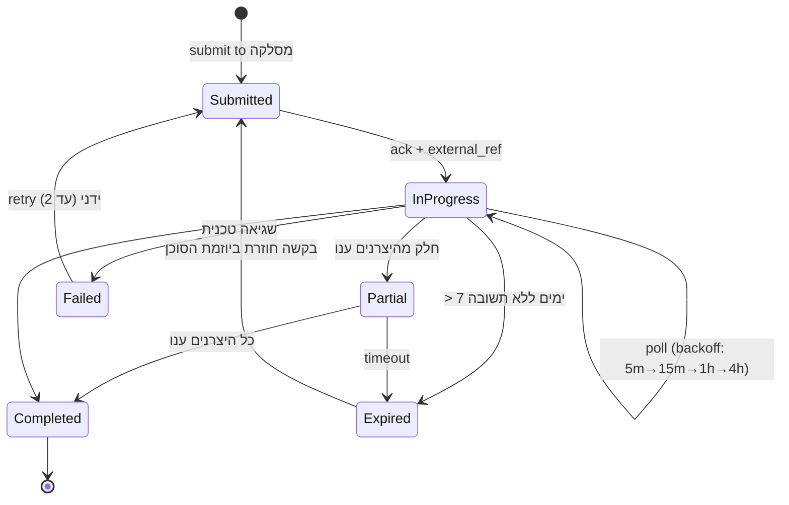
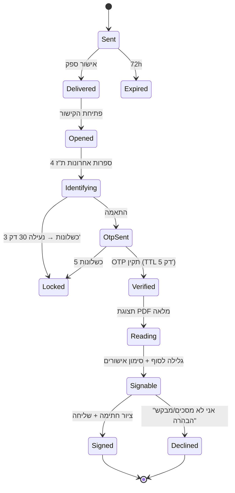

# 03 — זרימת משתמש (User Flow Walkthrough)

## 0. מפת המסע ברמה גבוהה

```mermaid
flowchart LR
    S1["1<br/>הקמת לקוח"] --> S2["2<br/>ייפוי כוח"] --> S3["3<br/>בקשה למסלקה"]
    S3 --> S4["4<br/>קליטה ופענוח"] --> S5["5<br/>טיפול בחריגים"]
    S5 --> S6["6<br/>תיק 360°"] --> S7["7<br/>בניית המלצה"]
    S7 --> S8["8<br/>אזהרות סיכון"] --> S9["9<br/>הפקת הנמקה"]
    S9 --> S10["10<br/>שליחה לחתימה"] --> S11["11<br/>חתימת לקוח"]
    S11 --> S12["12<br/>נעילה וארכוב"]
    style S9 fill:#fff4d6
    style S11 fill:#e6ffed
```



**זמן עבודת סוכן נטו ביעד: 35–45 דקות.** רוב הזמן בשלבים 6–8. שלב 4 אסינכרוני (שעות עד ימים).

---

## שלב 1 — הקמת לקוח (2 דק')

**מסך:** `לקוחות → לקוח חדש`

| שדה | חובה | הערות |
|---|---|---|
| ת"ז | ✅ | ולידציית ספרת ביקורת (אלגוריתם ת"ז ישראלי) בצד לקוח ושרת |
| שם פרטי/משפחה | ✅ | |
| תאריך לידה | ✅ | נגזר ממנו גיל פרישה, מסלול תלוי גיל |
| טלפון נייד | ✅ | E.164, נדרש ל-OTP בחתימה |
| דוא"ל | — | |
| מצב משפחתי + בני משפחה | — | משפיע על חישוב שאירים ועל פוליסות פרט |
| עיסוק, מעסיק, שכר ברוטו, ותק | — | משפיע על תקרות והפקדות |
| הצהרת בריאות בסיסית | — | מזין את `R-INS-004` |

**התנהגות מערכת:**
- זיהוי כפילות: אם `national_id_hash` כבר קיים ב-Tenant — מוצג הלקוח הקיים במקום יצירה כפולה.
- אם ה-ת"ז קיימת אצל **סוכן אחר באותה סוכנות** — מוצגת הודעה "הלקוח מטופל ע"י X",
  ומאפשרת בקשת שיוך (נרשם ב-Audit). אין דליפת נתונים בין סוכנים לפני האישור.
- כל שדה שנוצר ידנית מסומן `source='manual'` — כדי שבשלב 6 יהיה ברור מה הגיע מהמסלקה ומה לא.

---

## שלב 2 — ייפוי כוח והרשאות (3 דק')

**מסך:** `תיק לקוח → הרשאות`

1. הסוכן בוחר סוג הרשאה: **ייפוי כוח למסלקה** (`clearing_poa`) + **הסכמה לעיבוד מידע**.
2. הגדרת היקף: מידע מלא / חלקי / יצרנים ספציפיים, ותוקף.
3. **החתמת הלקוח על ייפוי הכוח מתבצעת באותו מנגנון e-Sign** של שלב 10 —
   אותו רכיב, `doc_type='poa'`. יתרון: אין שני מנגנוני חתימה במערכת.
4. עם קבלת החתימה נוצרת רשומת `clients.consents` עם `evidence_s3_key` + `sha256`.

**כלל חוסם:** לא ניתן לשלוח בקשה למסלקה ללא `consent` תקף (לא פג, לא בוטל).
ה-API מחזיר `409 CONSENT_REQUIRED`, וה-UI מציג CTA להחתמה.

---

## שלב 3 — בקשה למסלקה הפנסיונית (1 דק')

**מסך:** `תיק לקוח → משיכת נתונים`

- הסוכן בוחר: **תיק מלא** (מומלץ) או יצרנים ספציפיים.
- המערכת מציגה **עלות משוערת** של הבקשה לפני שליחה (`cost_agorot`) — שקיפות תפעולית
  שאין בכלל במערכות הקיימות.
- לחיצה על "שלח בקשה" ⇒ `POST /clearing-requests` עם `Idempotency-Key`
  (מונע כפל חיוב בלחיצה כפולה או ב-retry של הרשת).
- מיידית מוחזר `202 Accepted` + מזהה בקשה. הסוכן ממשיך לעבוד; אין מסך "אנא המתן".

**מאחורי הקלעים (Step Functions Saga):**



**התראות לסוכן:** Push/מייל ב-`Partial` הראשון וב-`Completed`. אין Polling מהדפדפן —
עדכון חי ב-Server-Sent Events על מסך התיק.

---

## שלב 4 — קליטה, פענוח ונרמול (אוטומטי, 0 דק' סוכן)

לכל קובץ שמגיע: `Land → Sanitize → Extract → Normalize → Reconcile` (ראה `01-architecture.md §3.3`).
בסיום נבנה תיק קנוני. המדד שמוצג לסוכן: **"שלמות נתונים 94% — 3 שדות חסרים ב-2 קופות"**.

---

## שלב 5 — טיפול בחריגים (0–5 דק', רק אם צריך)

**מסך:** `תיק לקוח → מרכז חריגים`

המערכת לא מסתירה בעיות, אלא הופכת אותן למשימות ברורות:

| חריג | מה הסוכן רואה | פעולה אפשרית |
|---|---|---|
| שדה חובה חסר | "דמי ניהול מצבירה — לא התקבל מ'מנורה', פוליסה 1234" | השלמה ידנית (מסומנת `source='manual'` + נרשמת באודיט) / סימון "לא התקבל מהמסלקה" |
| יצרן לא ענה | "לא התקבל מידע מ'הפניקס'" | בקשה חוזרת ליצרן בודד |
| קובץ ב-Quarantine | "קובץ מ-X לא ניתן לפענוח — הועבר לטיפול" | פתיחת קריאה אוטומטית לתמיכה, ה-SLA מוצג |
| חשד לאי-התאמת ת"ז | "אי-התאמה בזיהוי — הקובץ נחסם" | **חסום לסוכן**, מטופל ע"י Security |
| מוצר לא מזוהה | "מוצר לא מזוהה — מוצג בתיק, לא ניתן לכלול בהמלצה" | סיווג ידני ע"י מנהל |

**עיקרון UX:** כל חריג הוא כרטיס עם *מה קרה*, *מה ההשלכה*, *מה לעשות*. בלי קודי שגיאה.

---

## שלב 6 — תיק לקוח ותמונת 360° (10–15 דק')

**מסך:** `תיק לקוח → סקירה`

```
┌────────────────────────────────────────────────────────────────────┐
│  דנה כהן  ·  ת.ז 0****789  ·  בת 41  ·  נשואה +2                 │
│  עודכן: 12/03 מהמסלקה  ·  שלמות נתונים 94% ⓘ                      │
├──────────────┬──────────────┬──────────────┬───────────────────────┤
│ סה"כ צבירה   │ הפקדה חודשית │ דמי ניהול    │ כיסוי א.כ.ע           │
│ ₪1,284,300   │ ₪4,120       │ 0.42% / 2.1% │ ₪9,400 (68% מהשכר) ⚠ │
├──────────────┴──────────────┴──────────────┴───────────────────────┤
│ [ פנסיוני 4 ]  [ פיננסי 2 ]  [ פוליסות פרט 3 ]  [ כיסויים ]        │
│                                                                    │
│  קרן פנסיה מקיפה · מיטב · 5512340                     ₪842,100    │
│  מסלול: תלוי גיל  ·  ד"נ: 0.22% צבירה / 1.49% הפקדה               │
│  ⚠ הטבת דמי ניהול מסתיימת 31/12/2026                              │
│  ────────────────────────────────────────────────────────────      │
│  ביטוח מנהלים · כלל · 8871200                         ₪310,500    │
│  🔒 מקדם קצבה מובטח (הצטרפות 2009) — ניוד יגרום לאובדן זכות       │
│  ────────────────────────────────────────────────────────────      │
│  קרן השתלמות · אלטשולר · 77321  (לא פעילה, ללא הפקדות 26 חודשים)  │
└────────────────────────────────────────────────────────────────────┘
```

**דרישות UX מחייבות:**
- **RTL אמיתי**: מספרים ומטבע מיושרים נכון, טבלאות משמאל לימין בעמודות ערכיות, גרפים מראה.
- **מקור כל נתון גלוי**: ריחוף על ערך מציג `מקור: מסלקה / מנורה / 12.03.2026` או `הוזן ידנית ע"י דני`.
- **שקיפות חוסרים**: שדה חסר מוצג כ-`— לא התקבל`, **לא כ-0**. זהו הבדל קריטי מהמערכות הקיימות
  שמציגות 0 ומטעות את הסוכן.
- **מצבים לא פעילים מקופלים** אך לא מוסתרים.
- ויזואליזציות: פילוח צבירה לפי יצרן, מגמת דמי ניהול מול ממוצע ענפי, פער כיסוי א.כ.ע מול השכר.

---

## שלב 7 — בניית המלצה (10 דק')

**מסך:** `תיק לקוח → המלצה חדשה` — אשף בן 4 צעדים.

**7.1 צרכים ומטרות** — הסוכן מתעד את מה שהלקוח מסר: מטרות, אופק, סובלנות סיכון,
צרכי כיסוי. כולל צ'קבוקס **"הלקוח סירב למסור מידע"** + שדה חובה
**"השפעת אי-מסירת המידע על ההמלצה"** (דרישת התקנות).

**7.2 בניית מהלכים** — לכל מהלך: סוג (`ניוד`, `שינוי מסלול`, `הפחתת ד"נ`, `הוספת כיסוי`,
`ללא שינוי`), מקור, יעד, ונימוקים מקטלוג מאושר + נימוק חופשי.

> **חשוב:** גם `no_change` הוא מהלך לגיטימי שדורש נימוק. מסמך הנמקה שממליץ "להשאיר כפי שהוא"
> הוא מסמך תקף — והמערכת תומכת בו במפורש.

**7.3 יצירת Snapshot** — ברגע המעבר לצעד 3, המערכת יוצרת `portfolio_snapshot` נעול.
מכאן והלאה, גם אם יגיע קובץ מסלקה חדש — **ההמלצה נשארת על הנתונים שהוצגו ללקוח**.
עדכון דורש יצירת המלצה חדשה במפורש.

**7.4 טבלת השוואה אוטומטית**

| פרמטר | קיים | מוצע | תקרה/מדד | הפרש |
|---|---|---|---|---|
| ד"נ מצבירה | 1.05% | 0.35% | תקרה: לפי `regulatory_params` | ‎-0.70% |
| ד"נ מהפקדה | 4.00% | 1.49% | ממוצע ענפי: 1.82% | ‎-2.51% |
| תשואה 3 שנים | 4.1% | 6.3% | Benchmark: 5.8% | ‎+2.2% |
| א.כ.ע חודשי | ₪9,400 | ₪12,600 | 75% משכר | ‎+₪3,200 |
| חיסכון מצטבר לפרישה (הערכה) | — | — | — | ‎+₪183,000* |

`*` כל חישוב תחזיתי מוצג עם הנחות מפורשות (תשואה, אינפלציה, ותק) ומופיע בהנמקה
עם disclaimer — לעולם לא כהבטחה.

---

## שלב 8 — אזהרות סיכון ובקרת ציות (3 דק')

מנוע החוקים רץ בכל שינוי בהמלצה ומציג פאנל אזהרות חי:

```
🛑 חוסם   ניוד מביטוח מנהלים 8871200 — מקדם קצבה מובטח 1:167
          ניוד יבטל את המקדם. חובה: נימוק מפורש + הצהרת לקוח נפרדת.
          [ הוסף נימוק ]  [ הסר מהלך זה ]

⚠ קריטי   ביטול א.כ.ע קיים — חידוש כיסוי כפוף לחיתום רפואי ולתקופת אכשרה.
          [ אשר שהוסבר ללקוח ]

⚠ אזהרה   פוליסת בריאות 2011 בעלת תנאי דור קודם. נדרש נימוק להחלפה.

ℹ מידע    אין מוטבים מעודכנים בקופה המומלצת. [ צור משימה ]
```

- **`blocker` פתוח ⇒ כפתור "הפק מסמך הנמקה" מושבת.** ללא עקיפות, ללא "אני מאשר בכל זאת".
- כל `ack` נשמר ב-`reco.flags` עם חותמת זמן ומזהה סוכן, ומודפס בגוף המסמך.
- אזהרות ברמת `critical` יופיעו גם ללקוח בעת החתימה, עם צ'קבוקס אישור נפרד.

---

## שלב 9 — הפקת מסמך ההנמקה (30 שניות)

**Compliance Linter** רץ לפני הרינדור ובודק את מבנה החובה. אם חסר — `422` עם רשימה מדויקת.

**מבנה מסמך ההנמקה (תבנית `reasoning_v1`):**

| # | פרק | תוכן |
|---|---|---|
| 1 | כותרת וזיהוי | שם הלקוח, ת"ז, תאריך; שם בעל הרישיון, מספר רישיון, סוכנות |
| 2 | גילוי נאות וזיקה | זיקה לגופים מוסדיים, אופן התגמול, הצהרת שיווק פנסיוני מול ייעוץ |
| 3 | הנתונים ששימשו | מקור (מסלקה/הצהרת לקוח/הר הביטוח) + תאריך נכונות + **שדות שלא התקבלו** |
| 4 | צרכי הלקוח | מטרות, אופק, סיכון, שינויים במצב המשפחתי/תעסוקתי |
| 5 | אי-מסירת מידע | אם רלוונטי — מה לא נמסר והשפעתו על ההמלצה |
| 6 | התיק הקיים | טבלת מוצרים: יצרן, מס' פוליסה, צבירה, מסלול, ד"נ, כיסויים |
| 7 | ההמלצה | פירוט כל מהלך: מה, מאיפה, לאן, וכמה |
| 8 | הנימוקים | לכל מהלך — נימוקים מקטלוג + נימוק חופשי, קשורים לצרכים מפרק 4 |
| 9 | השוואות | דמי ניהול, תשואות מול Benchmark, כיסויים ועלויותיהם |
| 10 | חלופות שנשקלו | מה נבחן ומדוע נדחה |
| 11 | **אזהרות וסיכונים** | כל ה-flags ברמת warning ומעלה, בשפה פשוטה |
| 12 | הצהרות וחתימות | הצהרת לקוח, הצהרת בעל רישיון, אזור חתימה, תאריך |
| נספח | Data Provenance | `snapshot_sha256`, `document_sha256`, גרסאות מנוע ותבנית, רשימת קבצי מקור |

**פלט:** PDF/A-2b, עברית מוטמעת (Assistant), RTL תקין, מספור `עמוד X מתוך Y`,
QR לאימות מקוון של ה-hash. נשמר ב-S3 מוצפן.

---

## שלב 10 — שליחה לחתימה (30 שניות)

**מסך:** `מסמך → שלח לחתימה`

- ערוץ: **WhatsApp** (ברירת מחדל, שיעור פתיחה גבוה) / **SMS** / קישור להעתקה לחתימה פרונטלית.
- הודעה מתבנית מאושרת, **ללא PII מעבר לשם פרטי**:
  > "שלום דנה, מסמך ההנמקה מ<שם סוכנות> ממתין לחתימתך: https://sign.pensionos.co.il/s/xK9…
  > הקישור בתוקף ל-72 שעות."
- טוקן: 256-bit אקראי, נשמר כ-hash בלבד, חד-פעמי, TTL 72 שעות.
- תזכורות אוטומטיות: אחרי 24 ו-48 שעות (ניתן לכיבוי), מקסימום 2.

---

## שלב 11 — חתימת הלקוח בנייד (2–4 דק' לקוח)



**חוויית הלקוח:**
1. פתיחה בדפדפן הנייד — ללא הורדת אפליקציה, ללא הרשמה.
2. אימות דו-שלבי קל: 4 ספרות ת"ז ⇒ OTP ל-SMS.
3. **תקציר "מה משתנה לך"** בראש המסך (3 בולטים בשפה אנושית), ואז המסמך המלא.
4. **חובת גלילה לסוף** — כפתור החתימה מושבת עד גלילה מלאה (נרשם כראייה `scrolled_to_end`).
5. צ'קבוקסים נפרדים: "קראתי והבנתי", ואישור ייעודי לכל אזהרה קריטית.
6. ציור חתימה על המסך (Canvas → PNG), או הקלדת שם עם אישור.
7. אפשרות **"יש לי שאלה"** ⇒ `declined` + התראה מיידית לסוכן. אין לחץ לחתום.

**נגישות:** תקן ישראלי 5568 / WCAG 2.1 AA — ניגודיות, ניווט מקלדת, קורא מסך, גופן מתכוונן.

---

## שלב 12 — נעילה, ארכוב והמשך (אוטומטי)

1. חתימת **PAdES-B-LT** על ה-PDF + **חותמת זמן RFC-3161** מ-TSA חיצוני.
2. שמירה ל-S3 עם **Object Lock במצב Compliance ל-7 שנים** — לא ניתן למחוק, גם לא ע"י root.
3. `envelopes.status = SIGNED` — מצב סופי. כל ניסוי לשנות ⇒ `409`.
4. שליחת עותק חתום ללקוח (קישור מאובטח בתוקף 30 יום) ולסוכן.
5. יצירת `interaction` אוטומטי + משימת המשך ("הגשת בקשת ניוד ליצרן").
6. עדכון `documents.status='signed'`, `recommendations.status='signed'`.
7. Evidence Package נשמר לצד ה-PDF ונגיש למסך "אימות מסמך" עבור מבקר.

---

## נתיבי חריגה (Unhappy Paths) — חובה ל-MVP

| תרחיש | התנהגות |
|---|---|
| הלקוח לא חתם תוך 72h | Envelope `expired`; הסוכן שולח מחדש בקליק (מסמך זהה, טוקן חדש) |
| הלקוח ביקש הבהרה | `declined` + סיבה חופשית → התראה לסוכן → תיקון = **מסמך חדש** עם `supersedes_id` |
| נתונים השתנו אחרי ההפקה | ההמלצה נשארת על ה-Snapshot. באנר: "התקבלו נתונים חדשים — יצירת המלצה מעודכנת?" |
| הסוכן עזב את הסוכנות | `agency_admin` משייך מחדש לקוחות; המסמכים החתומים נשארים ברמת ה-Tenant |
| הלקוח ביטל ייפוי כוח | חסימת בקשות מסלקה חדשות; נתונים קיימים נשמרים לפי חובת השמירה, מסומנים `consent_revoked` |
| נפילת ספק SMS | Fallback אוטומטי לערוץ המשני; אם שניהם למטה — קישור להעתקה ידנית + התראה |
| מסמך נחתם פעמיים (Double submit) | Idempotency על `envelope_id` — החתימה הראשונה מנצחת, השנייה `409` |
