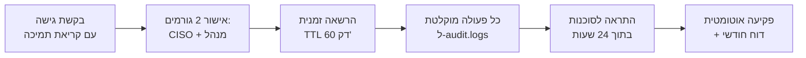

# 05 — אבטחת מידע, פרטיות וציות רגולטורי

> **הבהרה:** מסמך זה הוא מפרט הנדסי, לא חוות דעת משפטית. שמות התקנות והפניות
> מובאים לצורך תכנון בקרות. **כל סעיף מסומן ⚖️ מחייב אישור יועמ"ש/יועץ ציות
> לפני Go-Live**, כולל אימות מספור סעיפים מול הנוסח המעודכן.

---

## 1. מיפוי תפקידים משפטי

| ישות | תפקיד | משמעות |
|---|---|---|
| **הסוכנות** | **בעלת המאגר** | אחראית כלפי נושאי המידע, מגדירה מטרות עיבוד, מנהלת הרשאות |
| **PensionOS** | **מחזיקה** (Processor) | מעבדת בשם הסוכנות בלבד, לפי הוראותיה, ללא שימוש עצמאי במידע |
| **הסוכן** | משתמש מורשה | גישה מוגבלת ללקוחות בטיפולו |
| **הלקוח** | נושא מידע | זכות עיון, תיקון, ומיצוי זכויותיו לפי החוק |

**נגזרות מחייבות:**
- ⚖️ **הסכם מיקור חוץ (DPA)** מול כל סוכנות, הכולל: היקף המידע ומטרות העיבוד, סוגי
  הגישה, בקרות אבטחה, איסור שימוש משני, טיפול באירועי אבטחה והודעה מיידית, החזרת/מחיקת
  מידע בסיום ההתקשרות, זכות ביקורת של בעל המאגר, ורשימת קבלני משנה (AWS, ספק SMS, TSA).
- **אין שימוש במידע לקוחות לאימון מודלים, לניתוחים חוצי-סוכנויות או ל-Benchmarking**
  ללא הסכמה מפורשת ובכתב של הסוכנות. אגרגציה אנונימית — רק ב-Roadmap ורק עם הסכם נפרד.
- **PensionOS לא נותנת ייעוץ/שיווק פנסיוני.** המערכת כלי עזר; האחריות המקצועית על ההמלצה
  היא של בעל הרישיון. הצהרה זו מופיעה גם בתנאי השימוש וגם בגוף מסמך ההנמקה.

---

## 2. סיווג המאגר ורגישות המידע

| קטגוריה | דוגמאות | רגישות |
|---|---|---|
| מזהים | ת"ז, שם, כתובת, טלפון | גבוהה — ת"ז מוצפנת ברמת עמודה |
| פיננסי | צבירות, שכר, הפקדות, דמי ניהול | גבוהה |
| **רפואי** | הצהרת בריאות, החרגות רפואיות, כיסויי בריאות/סיעוד | **מידע רגיש בהגדרת החוק** |
| משפחתי | בני זוג, ילדים, מוטבים | בינונית-גבוהה |
| ראייתי | חתימות, IP, לוגי חתימה | גבוהה |

**מסקנה:** המאגר מסווג **ברמת אבטחה גבוהה**, והמערכת נבנית לרמה זו מהיום הראשון —
לא כשדרוג עתידי. ⚖️ לאימות סיווג סופי מול יועץ.

---

## 3. מיפוי בקרות — תקנות הגנת הפרטיות (אבטחת מידע), התשע"ז-2017

| נושא בתקנות | הבקרה שלנו ב-MVP | סטטוס |
|---|---|---|
| **מסמך הגדרות המאגר** | מסמך חי בריפו (`compliance/db-definition.md`): מטרות, סוגי מידע, מיקום, גורמים בעלי גישה, סיכונים עיקריים; עדכון בכל שינוי מהותי | Sprint 1 |
| **ממונה אבטחת מידע** | מינוי CISO/ממונה; ⚖️ בחינת חובת מינוי **ממונה הגנת פרטיות (DPO)** לפי תיקון 13 | Sprint 0 |
| **נוהל אבטחת מידע** | נוהל כתוב + Runbooks: הרשאות, גיבוי, אירועים, פיתוח מאובטח, מיקור חוץ | Sprint 2 |
| **מיפוי מערכות וסקר סיכונים** | דיאגרמת Data Flow + מיפוי נכסים ב-CDN(IaC); סקר סיכונים לפני Go-Live | Sprint 5 |
| **אבטחה פיזית** | מועברת ל-AWS (Shared Responsibility) — ⚖️ נשען על ISO 27001/SOC 2 של AWS; אין שרתים במשרד |  |
| **ניהול כוח אדם** | בדיקת רקע לעובדים עם גישת Production; הדרכת אבטחה בקליטה ושנתית; NDA; ביטול גישה מיידי בעזיבה (Offboarding checklist אוטומטי) | Sprint 2 |
| **הרשאות גישה** | RBAC 4 תפקידים + RLS ב-DB + עקרון Least Privilege; **גישת עובדי PensionOS ל-Production אסורה כברירת מחדל** — רק Break-glass (§6) | Sprint 1–3 |
| **תיעוד גישה (Logging)** | `audit.logs` append-only: מי, מתי, לאיזה לקוח, מאיזה IP, איזו פעולה. **שמירה ≥ 24 חודשים**. כולל קריאות (READ), לא רק שינויים | Sprint 2 |
| **אירוע אבטחה** | נוהל IR עם סיווג חומרה, צוות, זמני תגובה, ⚖️ **חובת דיווח לרשות להגנת הפרטיות ולסוכנות (בעלת המאגר) בתוך זמן קצר**; תרגיל שולחני אחת לשנה | Sprint 5 |
| **ניידות מדיה** | אין ייצוא לדיסקים ניידים. ייצוא נתונים רק דרך המערכת, מוצפן, מתועד באודיט, ומוגבל לתפקידים מורשים | Sprint 3 |
| **אבטחת תקשורת** | TLS 1.3 בכל נתיב; mTLS בין שירותים פנימיים ומול המסלקה; VPC פרטי; Egress allowlist | Sprint 1 |
| **חיבור למערכות חיצוניות** | רק ספקים מאושרים ברשימה; אימות הדדי; ניטור תעבורה חריגה | Sprint 3 |
| **מיקור חוץ** | DPA מול הסוכנויות; רשימת קבלני משנה מתועדת ומעודכנת; בחינת אבטחה לכל ספק חדש | Sprint 0 |
| **ביקורות תקופתיות** | ⚖️ למאגר ברמה גבוהה: סקר סיכונים ומבדקי חדירות **אחת ל-18 חודשים**, וביקורת ציות תקופתית. הראשון — **לפני Go-Live** | Sprint 5–6 |

### תיקון 13 לחוק הגנת הפרטיות ⚖️

תיקון 13 (בתוקף מאוגוסט 2025) שינה מהותית את מפת האכיפה. השפעות שיש להיערך אליהן:

- **עיצומים כספיים משמעותיים** וסמכויות אכיפה מורחבות לרשות להגנת הפרטיות.
- **חובת מינוי ממונה על הגנת הפרטיות (DPO)** לגופים שעיסוקם העיקרי עיבוד מידע רגיש
  בהיקף משמעותי — ⚖️ סביר שחל על PensionOS כמחזיקה. יש להיערך למינוי.
- **חובות יידוע והרחבת זכויות נושאי מידע** — פורטל/תהליך לבקשות עיון ותיקון.
- שינויים בחובת רישום מאגרים.

**פעולה נדרשת:** חוות דעת ציות ייעודית ב-Sprint 0, ותוכנית עבודה נגזרת. אין להתחיל
פיילוט עם לקוחות אמיתיים לפני שהיא בידינו.

### רגולציית רשות שוק ההון ⚖️

מעבר לפרטיות, חלים על הסוכנות (וגם עלינו כספק) עקרונות מחוזרי הרשות בנושאי
**ניהול סיכוני סייבר**, **מיקור חוץ** ו**ניהול מאגרי מידע**. נדרש מיפוי פערים ייעודי,
ולוודא שהמערכת מספקת לסוכנות את הראיות שהיא נדרשת להציג במסגרתם (לוגים, דוחות ציות, DR).

---

## 4. בקרות טכניות מרכזיות

### 4.1 הצפנה

| שכבה | מנגנון |
|---|---|
| In transit חיצוני | TLS 1.3 בלבד (TLS 1.2 רק אם נדרש למסלקה), HSTS preload, ללא צפנים חלשים |
| In transit פנימי | mTLS בין Fargate services; SQS/S3 דרך VPC Endpoints (לא דרך האינטרנט) |
| At rest — DB | Aurora encryption עם **KMS CMK** (לא מפתח AWS מנוהל) |
| At rest — S3 | SSE-KMS, **CMK נפרד לכל Tenant** |
| **ברמת שדה** | ת"ז, פרטי בנק, הצהרת בריאות — Envelope encryption (`pgcrypto` / KMS Data Key). DBA עם גישת SQL **לא** רואה ת"ז בטקסט גלוי |
| חיפוש על מוצפן | HMAC-SHA256 עם מפתח per-tenant ⇒ `national_id_hash` (deterministic, ניתן לאינדוקס, לא הפיך) |
| מפתחות חתימה | AWS KMS Asymmetric — **החומר הקריפטוגרפי לעולם לא עוזב את ה-HSM** |
| רוטציה | CMK רוטציה שנתית אוטומטית; סודות אפליקציה — 90 יום |

### 4.2 בקרת גישה

```
Layer 1  WAF          — Rate limit, Geo (חסימת גישה מחוץ לישראל לקונסולת הסוכן), OWASP rules
Layer 2  Cognito      — OIDC, MFA חובה לכל המשתמשים (לא רק אדמינים), Session 8h, Refresh 12h
Layer 3  NestJS Guard — RBAC + בדיקת שיוך Tenant לכל בקשה
Layer 4  PostgreSQL   — RLS (SET LOCAL app.current_tenant/user/role)
Layer 5  KMS          — CMK per tenant; Key policy מגבילה לתפקיד השירות בלבד
```

**דרישת תקנות — "אמצעי זיהוי נוסף בגישה מרחוק":** מכיוון שכל הגישה למערכת היא מרחוק
(SaaS), **MFA היא חובה לכל משתמש**, ללא אפשרות ביטול ברמת Tenant.

### 4.3 הגנה על פורטל החתימה (המשטח החשוף ביותר)

| איום | בקרה |
|---|---|
| ניחוש טוקן | 256-bit CSPRNG, נשמר כ-hash בלבד; TTL 72h; חד-פעמי |
| Brute force על 4 ספרות ת"ז | 3 ניסיונות ⇒ נעילה 30 דק' + התראה לסוכן |
| Brute force על OTP | 5 ניסיונות, TTL 5 דק', throttling ב-Redis לפי טוקן **ולפי IP** |
| SIM swap / גישה לנייד | אימות דו-גורמי (ידע: ת"ז + החזקה: OTP) + Evidence Package מלא; ⚖️ בחינת שדרוג לזיהוי חזק בעסקאות מהותיות |
| Replay של קישור אחרי חתימה | לאחר `SIGNED` הטוקן נשרף; עותק ללקוח נשלח בקישור נפרד ל-30 יום |
| XSS/Clickjacking | CSP נוקשה ללא `unsafe-inline`, `frame-ancestors 'none'`, SameSite=Strict |
| הדלפת PII ב-SMS | תוכן ההודעה: שם פרטי + קישור בלבד. אין ת"ז, אין סכומים, אין שם מוצר |

### 4.4 פיתוח מאובטח (SSDLC)

- Code review חובה (2 מאשרים לקוד שנוגע ב-Auth/Crypto/RLS), אין push ישיר ל-`main`.
- Threat Modeling (STRIDE) לכל Epic חדש; תיעוד בריפו.
- CI חוסם: CodeQL, `pip-audit`/`npm audit` (High+), Trivy, Gitleaks, בדיקת RLS על מיגרציות.
- **Fixtures בלבד** ב-dev/staging. יצירת נתוני בדיקה סינתטיים (ת"ז תקינות-פורמט אך לא אמיתיות).
- אין לוגים עם PII: `pino` redact list + בדיקת CI שמאתרת דפוסי ת"ז בפלט לוגים.

---

## 5. חתימה אלקטרונית — הבסיס המשפטי ⚖️

חוק חתימה אלקטרונית, התשס"א-2001 מבחין בין רמות חתימה. גישת ה-MVP:

| רכיב | מימוש |
|---|---|
| ייחוד לחותם | אימות דו-גורמי (4 ספרות ת"ז + OTP לנייד רשום מראש בתיק) |
| שליטה ייחודית | הטוקן חד-פעמי, נשלח לערוץ שבשליטת הלקוח בלבד |
| זיהוי שינוי במסמך | חתימת PAdES על ה-hash; כל שינוי בבייט אחד שובר את החתימה |
| קיבוע זמן | חותמת זמן RFC-3161 מגורם חיצוני — לא שעון השרת שלנו |
| שרשרת ראיות | Evidence Package (IP, UA, מכשיר, זמני צפייה, גלילה לסוף, כל אירועי OTP) |
| שימור לטווח ארוך | PAdES-**B-LT** (כולל מידע אימות) + S3 Object Lock 7 שנים |

**החלטת בנייה מול קנייה:** ב-MVP בונים בעצמנו את שכבת החתימה, מאחורי ממשק
`ISigningProvider`. נימוקים: שליטה מלאה בעברית/RTL ובחוויית הלקוח, אין עלות למעטפה,
ואין ייצוא מסמכים המכילים PII לספק בחו"ל. אם יידרש מעמד של **חתימה אלקטרונית מאושרת**
(תעודה מגורם מאשר), ההחלפה היא מאחורי אותו ממשק ⇒ ⚖️ החלטה משפטית, לא ארכיטקטונית.

---

## 6. גישת צוות PensionOS למידע לקוחות — Break-Glass

עיקרון: **לאף עובד PensionOS אין גישה שוטפת לנתוני לקוחות בייצור.**



- דיבוג רגיל מתבצע על **מטא-דאטה בלבד** (מזהים, סטטוסים, קודי שגיאה) — לא על תוכן.
- Sentry/לוגים עוברים scrubbing; מפתח לא רואה ת"ז או סכומים בכלי ניטור.

---

## 7. המשכיות עסקית והתאוששות

| נכס | RPO | RTO | מנגנון |
|---|---|---|---|
| Aurora | 15 דק' | 4 שעות | PITR 35 יום + Multi-AZ |
| S3 מסמכים | 0 | מיידי | Versioning + Object Lock; העתק חוצה-AZ |
| קבצי מסלקה גולמיים | 0 | מיידי | S3 + אפשרות בקשה חוזרת |
| קוד/תשתית | — | 2 שעות | CDK מלא ב-Git — שחזור סביבה מאפס |

**תרגיל שחזור מלא רבעוני**, מתועד, כולל מדידת RTO בפועל. ⚖️ נדרש גם כראיה מול הסוכנות.

---

## 8. תוצרי ציות שיסופקו ללקוח (Trust Package)

חבילה שכל סוכנות מקבלת — גם כדי לעמוד בביקורת שלה מול הרשות:

1. מסמך תיאור אבטחה ואדריכלות (ללא סודות).
2. תבנית DPA/הסכם מיקור חוץ חתומה.
3. רשימת קבלני משנה ומיקומי אחסון (הכל בישראל, למעט שירותים ללא PII).
4. תמצית מבדק חדירות אחרון + סטטוס תיקונים.
5. **דוח ציות חודשי אוטומטי במערכת**: מסמכים שהופקו/נחתמו, הנמקות שנחסמו ומדוע,
   חריגי נתונים פתוחים, גישות חריגות.
6. יכולת **ייצוא מלא** של נתוני הסוכנות (JSON + PDFs) בכל עת — אין נעילת ספק.
